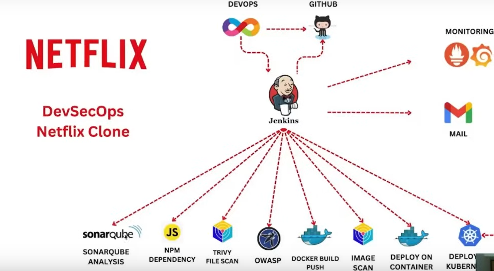
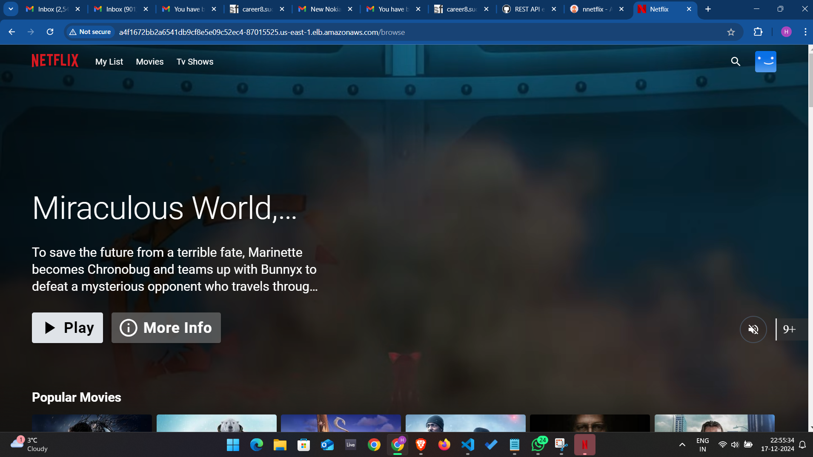

<div align="center">
  

  <br>
  <a href="http://netflix-clone-with-tmdb-using-react-mui.vercel.app/">
    
  </a>
</div>

<br />

<div align="center">
  
  <p align="center">Home Page</p>
</div>

# **Youtube Video for step by step Demonstration!**


# Deploy Netflix Clone on Cloud using Jenkins - DevSecOps Project!

### **Phase 1: Initial Setup and Deployment**

**Step 1: Launch EC2 (Ubuntu 22.04):**

- Provision an EC2 instance on AWS using Terraform-
# Terraform Setup and Usage on Windows

## 1. Install Terraform on Windows

### Download Terraform
- Go to the [Terraform Downloads page](https://www.terraform.io/downloads).
- Select the Windows version and download the ZIP file.

### Extract the ZIP File
- Extract the downloaded ZIP file to a directory (e.g., `C:\Terraform`).

### Add Terraform to PATH
- Press `Win + S`, search for "Environment Variables," and click **Edit the system environment variables**.
- In the **System Properties** window, click **Environment Variables**.
- Under **System variables**, select the `Path` variable and click **Edit**.
- Click **New** and add the path to the directory where `terraform.exe` is located (e.g., `C:\Terraform`).
- Click **OK** to save changes.

2. ### Verify Installation
- Open Command Prompt or PowerShell and run:
  ```bash
  terraform --version

3. ### Install Terraform Dependencies
Before initialising terraform, clone the repo and change  the working directory to EC2_deploy

    ```bash
    git clone https://github.com/hrithiksaini22/Netflix-Clone.git
    cd \Netflix-Clone\EC2_deploy
    ```
Initialize Terraform
Open Command Prompt or PowerShell.

Navigate to the project folder where your main.tf file is located:

cd C:\TerraformProjects\EC2_deploy

Run the following command to initialize Terraform:

terraform init

This command downloads the required provider plugins and prepares your working directory for Terraform usage.

4. ### Validate and Plan the Configuration
Validate the Configuration
To check for syntax errors or issues in your Terraform configuration, run:
```bash
terraform validate
```
Create an Execution Plan
Before applying the configuration, it's important to preview the changes that Terraform will make. Run:
```bash
terraform plan
```
This will show a summary of the actions Terraform will take to create, update, or delete resources.

5. ### Apply the Configuration
Apply Changes
After reviewing the plan, you can apply the configuration to create the resources. Run:
```bash
terraform apply -auto-approve
```
Terraform will display the proposed changes and prompt you to confirm by typing yes to proceed with the creation of resources.
Check the State
Terraform keeps track of the resources it manages in a state file (terraform.tfstate). To view the list of resources being managed, use the following command:
```bash
terraform state list
```
- Connect to the instance using SSH.

### Now open the EC2 instance from aws console and connect to the instance via Instance Connect

**Clone the Code:**

- Update all the packages and then clone the code.
- Clone your application's code repository onto the EC2 instance:
    
    ```bash
    git clone https://github.com/hrithiksaini22/Netflix-Clone.git

    ```
    

**Step 2: Install Docker and Run the App Using a Container:**

- Set up Docker on the EC2 instance:
    
    ```bash
    
    sudo apt-get update
    sudo apt-get install docker.io -y
    sudo usermod -aG docker $USER  # Replace with your system's username, e.g., 'ubuntu'
    newgrp docker
    sudo chmod 777 /var/run/docker.sock
    ```
    
- Build and run your application using Docker containers:
    
    ```bash
    docker build -t netflix .
    docker run -d --name netflix -p 8081:80 netflix:latest
    
    #to delete
    docker stop <containerid>
    docker rmi -f netflix
    ```

It will show an error cause you need API key

**Step 3: Get the API Key:**

- Open a web browser and navigate to TMDB (The Movie Database) website.
- Click on "Login" and create an account.
- Once logged in, go to your profile and select "Settings."
- Click on "API" from the left-side panel.
- Create a new API key by clicking "Create" and accepting the terms and conditions.
- Provide the required basic details and click "Submit."
- You will receive your TMDB API key.

Now recreate the Docker image with your api key:
```
docker build --build-arg TMDB_V3_API_KEY=<your-api-key> -t netflix .
```

**Phase 2: Security**

1. **Install SonarQube and Trivy:**
    - Install SonarQube and Trivy on the EC2 instance to scan for vulnerabilities.
        
        sonarqube
        ```
        docker run -d --name sonar -p 9000:9000 sonarqube:lts-community
        ```
        
        
        To access: 
        
        publicIP:9000 (by default username & password is admin)
        
        To install Trivy:
        ```
        sudo apt-get install wget apt-transport-https gnupg lsb-release
        wget -qO - https://aquasecurity.github.io/trivy-repo/deb/public.key | sudo apt-key add -
        echo deb https://aquasecurity.github.io/trivy-repo/deb $(lsb_release -sc) main | sudo tee -a /etc/apt/sources.list.d/trivy.list
        sudo apt-get update
        sudo apt-get install trivy        
        ```
        
        to scan image using trivy
        ```
        trivy image <imageid>
        ```
        
        
2. **Integrate SonarQube and Configure:**
    - Integrate SonarQube with your CI/CD pipeline.
    - Configure SonarQube to analyze code for quality and security issues.

**Phase 3: CI/CD Setup**

1. **Install Jenkins for Automation:**
    - Install Jenkins on the EC2 instance to automate deployment:
    Install Java
    
    ```bash
    sudo apt update
    sudo apt install fontconfig openjdk-17-jre
    java -version
    openjdk version "17.0.8" 2023-07-18
    OpenJDK Runtime Environment (build 17.0.8+7-Debian-1deb12u1)
    OpenJDK 64-Bit Server VM (build 17.0.8+7-Debian-1deb12u1, mixed mode, sharing)
    
    #jenkins
    sudo wget -O /usr/share/keyrings/jenkins-keyring.asc \
    https://pkg.jenkins.io/debian-stable/jenkins.io-2023.key
    echo deb [signed-by=/usr/share/keyrings/jenkins-keyring.asc] \
    https://pkg.jenkins.io/debian-stable binary/ | sudo tee \
    /etc/apt/sources.list.d/jenkins.list > /dev/null
    sudo apt-get update
    sudo apt-get install jenkins
    sudo systemctl start jenkins
    sudo systemctl enable jenkins
    ```
    
    - Access Jenkins in a web browser using the public IP of your EC2 instance.
        
        publicIp:8080
        
2. **Install Necessary Plugins in Jenkins:**

Goto Manage Jenkins →Plugins → Available Plugins →

Install below plugins

1 Eclipse Temurin Installer (Install without restart)

2 SonarQube Scanner (Install without restart)

3 NodeJs Plugin (Install Without restart)

4 Email Extension Plugin

### **Configure Java and Nodejs in Global Tool Configuration**

Goto Manage Jenkins → Tools → Install JDK(17) and NodeJs(16)→ Click on Apply and Save


### SonarQube

Create the token

Goto Jenkins Dashboard → Manage Jenkins → Credentials → Add Secret Text. It should look like this

After adding sonar token

Click on Apply and Save

**The Configure System option** is used in Jenkins to configure different server

**Global Tool Configuration** is used to configure different tools that we install using Plugins

We will install a sonar scanner in the tools.

Create a Jenkins webhook

1. **Configure CI/CD Pipeline in Jenkins:**
- Create a CI/CD pipeline in Jenkins to automate your application deployment.

```groovy
pipeline {
    agent any
    tools {
        jdk 'jdk17'
        nodejs 'node16'
    }
    environment {
        SCANNER_HOME = tool 'sonar-scanner'
    }
    stages {
        stage('clean workspace') {
            steps {
                cleanWs()
            }
        }
        stage('Checkout from Git') {
            steps {
                git branch: 'main', url: 'https://github.com/hrithiksaini22/Netflix-Clone.git'
            }
        }
        stage("Sonarqube Analysis") {
            steps {
                withSonarQubeEnv('sonar-server') {
                    sh '''$SCANNER_HOME/bin/sonar-scanner -Dsonar.projectName=Netflix \
                    -Dsonar.projectKey=Netflix'''
                }
            }
        }
        stage("quality gate") {
            steps {
                script {
                    waitForQualityGate abortPipeline: false, credentialsId: 'Sonar-token'
                }
            }
        }
        stage('Install Dependencies') {
            steps {
                sh "npm install"
            }
        }
    }
}
```

Certainly, here are the instructions without step numbers:

**Install Dependency-Check and Docker Tools in Jenkins**

**Install Dependency-Check Plugin:**

- Go to "Dashboard" in your Jenkins web interface.
- Navigate to "Manage Jenkins" → "Manage Plugins."
- Click on the "Available" tab and search for "OWASP Dependency-Check."
- Check the checkbox for "OWASP Dependency-Check" and click on the "Install without restart" button.

**Configure Dependency-Check Tool:**

- After installing the Dependency-Check plugin, you need to configure the tool.
- Go to "Dashboard" → "Manage Jenkins" → "Global Tool Configuration."
- Find the section for "OWASP Dependency-Check."
- Add the tool's name, e.g., "DP-Check."
- Save your settings.

**Install Docker Tools and Docker Plugins:**

- Go to "Dashboard" in your Jenkins web interface.
- Navigate to "Manage Jenkins" → "Manage Plugins."
- Click on the "Available" tab and search for "Docker."
- Check the following Docker-related plugins:
  - Docker
  - Docker Commons
  - Docker Pipeline
  - Docker API
  - docker-build-step
- Click on the "Install without restart" button to install these plugins.

** How to lauch and provide access to the ECR repo from EC2 instance:**
1. Create an ECR Repository
Via AWS Management Console:

Go to the Amazon ECR service in the AWS Console.
Click on Create Repository.
Provide the repository name (e.g., my-repository).
Choose settings like public or private visibility.
Click Create Repository.
Via AWS CLI: Run the following command:

aws ecr create-repository --repository-name my-repository --region <region>

Example:

aws ecr create-repository --repository-name my-repository --region us-east-1
Output: You’ll get the repository URI (e.g., 123456789012.dkr.ecr.us-east-1.amazonaws.com/my-repository).

2. Create and Attach an IAM Role to EC2
Create an IAM Role:

Go to the IAM service in the AWS Console.

Select Roles and click Create Role.

Under Trusted Entity Type, select AWS Service.

Select EC2 as the service that will use the role.

Attach the following policy:

AmazonEC2ContainerRegistryReadOnly: Provides read-only access to ECR.
(Optional) AmazonEC2ContainerRegistryFullAccess: Provides full access to ECR if you need push/pull capabilities.
Name the role (e.g., ECRAccessRole) and create it.

Attach the IAM Role to EC2:

Go to the EC2 Dashboard.
Select your instance.
Click Actions > Security > Modify IAM Role.
Choose the role you created (ECRAccessRole) and attach it.


Now, you have installed the Dependency-Check plugin, configured the tool, and added Docker-related plugins along with your DockerHub credentials in Jenkins. You can now proceed with configuring your Jenkins pipeline to include these tools and credentials in your CI/CD process.

```groovy
pipeline {
    agent any
    tools {
        jdk 'jdk17'
        nodejs 'node16'
    }
    environment {
        SCANNER_HOME = tool 'sonar-scanner'
        registry = "980921731940.dkr.ecr.us-east-1.amazonaws.com/my-repository"
    }
    stages {
        stage('Clean Workspace') {
            steps {
                cleanWs()
            }
        }
        stage('Checkout from Git') {
            steps {
                git branch: 'main', url: 'https://github.com/hrithiksaini22/Netflix-Clone.git'
            }
        }
        stage('SonarQube Analysis') {
            steps {
                withSonarQubeEnv('sonar-server') {
                    sh '''
                        $SCANNER_HOME/bin/sonar-scanner \
                        -Dsonar.projectName=Netflix \
                        -Dsonar.projectKey=Netflix
                    '''
                }
            }
        }
        stage('Quality Gate') {
            steps {
                script {
                    waitForQualityGate abortPipeline: false, credentialsId: 'Sonar-token'
                }
            }
        }
        stage('Install Dependencies') {
            steps {
                sh "npm install"
            }
        }
        stage('OWASP FS Scan') {
            steps {
                dependencyCheck additionalArguments: '--scan ./ --disableYarnAudit --disableNodeAudit', odcInstallation: 'DP-Check'
                dependencyCheckPublisher pattern: '**/dependency-check-report.xml'
            }
        }
        stage('Trivy FS Scan') {
            steps {
                sh "trivy fs . > trivyfs.txt"
            }
        }
        stage('Building Docker Image') {
            steps {
                script {
                    // List files for debugging purposes
                    sh 'ls -la /var/lib/jenkins/workspace/CI'
                    
                    // Build Docker image with an API key passed as a build argument
                    sh "docker build --build-arg TMDB_V3_API_KEY=<yourtmdbapikey> -t ${registry}:${env.BUILD_NUMBER} ."
                }
            }
        }
        stage('Trivy Image Scan') {
            steps {
                sh "trivy image ${registry}:${env.BUILD_NUMBER} > trivyimage.txt"
            }
        }
        stage('Pushing to ECR') {
            steps {
                script {
                    // Log in to ECR using AWS CLI
                    sh '''
                        aws ecr get-login-password --region us-east-1 | \
                        docker login --username AWS --password-stdin 980921731940.dkr.ecr.us-east-1.amazonaws.com
                    '''
                    
                    // Push Docker image to ECR
                    sh "docker push ${registry}:${env.BUILD_NUMBER}"
                }
            }
        }
    }
    post {
        always {
            // Clean the workspace
            cleanWs(deleteDirs: true)
            
            // Clean up Docker containers and volumes (optional)
            script {
                sh '''
                    docker container prune -f
                    docker volume prune -f
                    docker network prune -f
                '''
            }
        }
    }
}


```

**Phase 4: Monitoring**

Now we would be using our Monitoring Server which would be used to deploy Prometheus, Grafana and our EKS cluster and interact with it-

1. **Install Prometheus and Grafana:**
  
   Set up Prometheus and Grafana to monitor your application.

   **Installing Prometheus:**

   First, create a dedicated Linux user for Prometheus and download Prometheus:

   ```bash
   sudo useradd --system --no-create-home --shell /bin/false prometheus
   wget https://github.com/prometheus/prometheus/releases/download/v2.47.1/prometheus-2.47.1.linux-amd64.tar.gz
   ```

   Extract Prometheus files, move them, and create directories:

   ```bash
   tar -xvf prometheus-2.47.1.linux-amd64.tar.gz
   cd prometheus-2.47.1.linux-amd64/
   sudo mkdir -p /data /etc/prometheus
   sudo mv prometheus promtool /usr/local/bin/
   sudo mv consoles/ console_libraries/ /etc/prometheus/
   sudo mv prometheus.yml /etc/prometheus/prometheus.yml
   ```

   Set ownership for directories:

   ```bash
   sudo chown -R prometheus:prometheus /etc/prometheus/ /data/
   ```

   Create a systemd unit configuration file for Prometheus:

   ```bash
   sudo nano /etc/systemd/system/prometheus.service
   ```

   Add the following content to the `prometheus.service` file:

   ```plaintext
   [Unit]
   Description=Prometheus
   Wants=network-online.target
   After=network-online.target

   StartLimitIntervalSec=500
   StartLimitBurst=5

   [Service]
   User=prometheus
   Group=prometheus
   Type=simple
   Restart=on-failure
   RestartSec=5s
   ExecStart=/usr/local/bin/prometheus \
     --config.file=/etc/prometheus/prometheus.yml \
     --storage.tsdb.path=/data \
     --web.console.templates=/etc/prometheus/consoles \
     --web.console.libraries=/etc/prometheus/console_libraries \
     --web.listen-address=0.0.0.0:9090 \
     --web.enable-lifecycle

   [Install]
   WantedBy=multi-user.target
   ```

   Here's a brief explanation of the key parts in this `prometheus.service` file:

   - `User` and `Group` specify the Linux user and group under which Prometheus will run.

   - `ExecStart` is where you specify the Prometheus binary path, the location of the configuration file (`prometheus.yml`), the storage directory, and other settings.

   - `web.listen-address` configures Prometheus to listen on all network interfaces on port 9090.

   - `web.enable-lifecycle` allows for management of Prometheus through API calls.

   Enable and start Prometheus:

   ```bash
   sudo systemctl enable prometheus
   sudo systemctl start prometheus
   ```

   Verify Prometheus's status:

   ```bash
   sudo systemctl status prometheus
   ```

   You can access Prometheus in a web browser using your server's IP and port 9090:

   `http://<your-server-ip>:9090`

   **Installing Node Exporter:**

   Create a system user for Node Exporter and download Node Exporter:

   ```bash
   sudo useradd --system --no-create-home --shell /bin/false node_exporter
   wget https://github.com/prometheus/node_exporter/releases/download/v1.6.1/node_exporter-1.6.1.linux-amd64.tar.gz
   ```

   Extract Node Exporter files, move the binary, and clean up:

   ```bash
   tar -xvf node_exporter-1.6.1.linux-amd64.tar.gz
   sudo mv node_exporter-1.6.1.linux-amd64/node_exporter /usr/local/bin/
   rm -rf node_exporter*
   ```

   Create a systemd unit configuration file for Node Exporter:

   ```bash
   sudo nano /etc/systemd/system/node_exporter.service
   ```

   Add the following content to the `node_exporter.service` file:

   ```plaintext
   [Unit]
   Description=Node Exporter
   Wants=network-online.target
   After=network-online.target

   StartLimitIntervalSec=500
   StartLimitBurst=5

   [Service]
   User=node_exporter
   Group=node_exporter
   Type=simple
   Restart=on-failure
   RestartSec=5s
   ExecStart=/usr/local/bin/node_exporter --collector.logind

   [Install]
   WantedBy=multi-user.target
   ```

   Replace `--collector.logind` with any additional flags as needed.

   Enable and start Node Exporter:

   ```bash
   sudo systemctl enable node_exporter
   sudo systemctl start node_exporter
   ```

   Verify the Node Exporter's status:

   ```bash
   sudo systemctl status node_exporter
   ```

   You can access Node Exporter metrics in Prometheus.

2. **Configure Prometheus Plugin Integration:**

   Integrate Jenkins with Prometheus to monitor the CI/CD pipeline.

   **Prometheus Configuration:**

   To configure Prometheus to scrape metrics from Node Exporter and Jenkins, you need to modify the `prometheus.yml` file. Here is an example `prometheus.yml` configuration for your setup:

   ```yaml
   global:
     scrape_interval: 15s

   scrape_configs:
     - job_name: 'node_exporter'
       static_configs:
         - targets: ['localhost:9100']

     - job_name: 'jenkins'
       metrics_path: '/prometheus'
       static_configs:
         - targets: ['<your-jenkins-ip>:<your-jenkins-port>']
   ```

   Make sure to replace `<your-jenkins-ip>` and `<your-jenkins-port>` with the appropriate values for your Jenkins setup.

   Check the validity of the configuration file:

   ```bash
   promtool check config /etc/prometheus/prometheus.yml
   ```

   Reload the Prometheus configuration without restarting:

   ```bash
   curl -X POST http://localhost:9090/-/reload
   ```

   You can access Prometheus targets at:

   `http://<your-prometheus-ip>:9090/targets`


####Grafana

**Install Grafana on Ubuntu 22.04 and Set it up to Work with Prometheus**

**Step 1: Install Dependencies:**

First, ensure that all necessary dependencies are installed:

```bash
sudo apt-get update
sudo apt-get install -y apt-transport-https software-properties-common
```

**Step 2: Add the GPG Key:**

Add the GPG key for Grafana:

```bash
wget -q -O - https://packages.grafana.com/gpg.key | sudo apt-key add -
```

**Step 3: Add Grafana Repository:**

Add the repository for Grafana stable releases:

```bash
echo "deb https://packages.grafana.com/oss/deb stable main" | sudo tee -a /etc/apt/sources.list.d/grafana.list
```

**Step 4: Update and Install Grafana:**

Update the package list and install Grafana:

```bash
sudo apt-get update
sudo apt-get -y install grafana
```

**Step 5: Enable and Start Grafana Service:**

To automatically start Grafana after a reboot, enable the service:

```bash
sudo systemctl enable grafana-server
```

Then, start Grafana:

```bash
sudo systemctl start grafana-server
```

**Step 6: Check Grafana Status:**

Verify the status of the Grafana service to ensure it's running correctly:

```bash
sudo systemctl status grafana-server
```

**Step 7: Access Grafana Web Interface:**

Open a web browser and navigate to Grafana using your server's IP address. The default port for Grafana is 3000. For example:

`http://<your-server-ip>:3000`

You'll be prompted to log in to Grafana. The default username is "admin," and the default password is also "admin."

**Step 8: Change the Default Password:**

When you log in for the first time, Grafana will prompt you to change the default password for security reasons. Follow the prompts to set a new password.

**Step 9: Add Prometheus Data Source:**

To visualize metrics, you need to add a data source. Follow these steps:

- Click on the gear icon (⚙️) in the left sidebar to open the "Configuration" menu.

- Select "Data Sources."

- Click on the "Add data source" button.

- Choose "Prometheus" as the data source type.

- In the "HTTP" section:
  - Set the "URL" to `http://localhost:9090` (assuming Prometheus is running on the same server).
  - Click the "Save & Test" button to ensure the data source is working.

**Step 10: Import a Dashboard:**

To make it easier to view metrics, you can import a pre-configured dashboard. Follow these steps:

- Click on the "+" (plus) icon in the left sidebar to open the "Create" menu.

- Select "Dashboard."

- Click on the "Import" dashboard option.

- Enter the dashboard code you want to import (e.g., code 1860).

- Click the "Load" button.

- Select the data source you added (Prometheus) from the dropdown.

- Click on the "Import" button.

You should now have a Grafana dashboard set up to visualize metrics from Prometheus.

Grafana is a powerful tool for creating visualizations and dashboards, and you can further customize it to suit your specific monitoring needs.

That's it! You've successfully installed and set up Grafana to work with Prometheus for monitoring and visualization.

2. **Configure Prometheus Plugin Integration:**
    - Integrate Jenkins with Prometheus to monitor the CI/CD pipeline.


**Phase 5: Notification**

1. **Implement Notification Services:**
    - Set up email notifications in Jenkins or other notification mechanisms.

# Phase 6: Kubernetes

## Create Kubernetes Cluster with Nodegroups

In this phase, you'll set up a Kubernetes cluster with node groups. This will provide a scalable environment to deploy and manage your applications.

## Monitor Kubernetes with Prometheus

Prometheus is a powerful monitoring and alerting toolkit, and you'll use it to monitor your Kubernetes cluster. Additionally, you'll install the node exporter using Helm to collect metrics from your cluster nodes.

### Install Node Exporter using Helm

To begin monitoring your Kubernetes cluster, you'll install the Prometheus Node Exporter. This component allows you to collect system-level metrics from your cluster nodes. Here are the steps to install the Node Exporter using Helm:

1. Add the Prometheus Community Helm repository:

    ```bash
    helm repo add prometheus-community https://prometheus-community.github.io/helm-charts
    ```

2. Create a Kubernetes namespace for the Node Exporter:

    ```bash
    kubectl create namespace prometheus-node-exporter
    ```

3. Install the Node Exporter using Helm:

    ```bash
    helm install prometheus-node-exporter prometheus-community/prometheus-node-exporter --namespace prometheus-node-exporter
    ```

Add a Job to Scrape Metrics on nodeip:9001/metrics in prometheus.yml:

Update your Prometheus configuration (prometheus.yml) to add a new job for scraping metrics from nodeip:9001/metrics. You can do this by adding the following configuration to your prometheus.yml file:


```
  - job_name: 'Netflix'
    metrics_path: '/metrics'
    static_configs:
      - targets: ['node1Ip:9100']
```

Replace 'your-job-name' with a descriptive name for your job. The static_configs section specifies the targets to scrape metrics from, and in this case, it's set to nodeip:9001.

Don't forget to reload or restart Prometheus to apply these changes to your configuration.

To deploy an application with ArgoCD, you can follow these steps, which I'll outline in Markdown format:

### Continuos Deployment
Now we would be deploying a new Ubuntu EC2 instance which would be used to deploy our EKS cluster and interact with it-

1. Install AWS CLI
To interact with AWS services, we need to install AWS CLI version 2.

Download the AWS CLI version 2 installer:
curl "https://awscli.amazonaws.com/awscli-exe-linux-x86_64.zip" -o "awscliv2.zip"

Install the unzip tool (if not already installed):
sudo apt install unzip

Unzip the AWS CLI installer:
sudo unzip awscliv2.zip

Install AWS CLI:
sudo ./aws/install

Verify AWS CLI installation:
aws --version

2. Install eksctl
eksctl is a tool for creating and managing EKS clusters.

Download and install eksctl:
curl --silent --location "https://github.com/weaveworks/eksctl/releases/latest/download/eksctl_$(uname -s)_amd64.tar.gz" | tar xz -C /tmp

Move eksctl to /usr/local/bin:
sudo mv /tmp/eksctl /usr/local/bin

Verify eksctl installation:
eksctl version

3. Install kubectl
kubectl is a command-line tool to interact with Kubernetes clusters.

Download kubectl:
sudo curl --silent --location -o /usr/local/bin/kubectl https://s3.us-west-2.amazonaws.com/amazon-eks/1.22.6/2022-03-09/bin/linux/amd64/kubectl

Make kubectl executable:
sudo chmod +x /usr/local/bin/kubectl

Verify kubectl installation:
kubectl version --short --client

4. Deploy EKS Cluster
Use eksctl to create and manage an EKS cluster in AWS.

Create an EKS cluster:
eksctl create cluster --name demo-eks --region us-east-1 --nodegroup-name my-nodes --node-type t3.small --managed --nodes 2

Verify the EKS cluster status:
eksctl get cluster --name demo-eks --region us-east-1

Update kubeconfig to interact with the EKS cluster:
aws eks --region us-east-1 update-kubeconfig --name demo-eks


5. Install ArgoCD on EKS Cluster
ArgoCD is a GitOps continuous delivery tool for Kubernetes.

Create the argocd namespace:
kubectl create namespace argocd

Install ArgoCD by applying the official ArgoCD manifest:
kubectl apply -n argocd -f https://raw.githubusercontent.com/argoproj/argo-cd/stable/manifests/install.yaml

Expose the ArgoCD server by modifying the service type to LoadBalancer:
kubectl patch svc argocd-server -n argocd -p '{"spec": {"type": "LoadBalancer"}}'

Retrieve the initial admin password for ArgoCD:
kubectl get secret -n argocd argocd-initial-admin-secret -o jsonpath="{.data.password}" | base64 -d

### Access ArgoCD and configure with our github repository 

Step 1: Access ArgoCD UI via Load Balancer


Obtain the Load Balancer DNS name:

From the AWS Load Balancer details page, copy the DNS name. Example:
accc5153de474fafcb33569c0c833299-976374730.us-east-1.elb.amazonaws.com.
Access ArgoCD UI in a browser:

Open your browser and navigate to the Load Balancer URL:
http://accc5153de474fafcb33569c0c833299-976374730.us-east-1.elb.amazonaws.com.
Login to ArgoCD:


Use the admin username and the initial password fetched from the secret:
sql
Copy code
kubectl get secret -n argocd argocd-initial-admin-secret -o jsonpath="{.data.password}" | base64 -d
Step 2: Create a New Application in ArgoCD
In the ArgoCD UI:

Click on + New App.
Fill in Application Details:

Application Name: task-tracker-app
Project: default
Source:
Repo URL: https://github.com/hrithiksaini22/Task_Tracker.git
Path: k8s-manifests/
Target Revision: HEAD
Destination:
Cluster URL: https://kubernetes.default.svc
Namespace: vc
Sync Policy:
Automated Sync: Enable automated sync with no manual intervention.
Create the Application:

Click Create.
